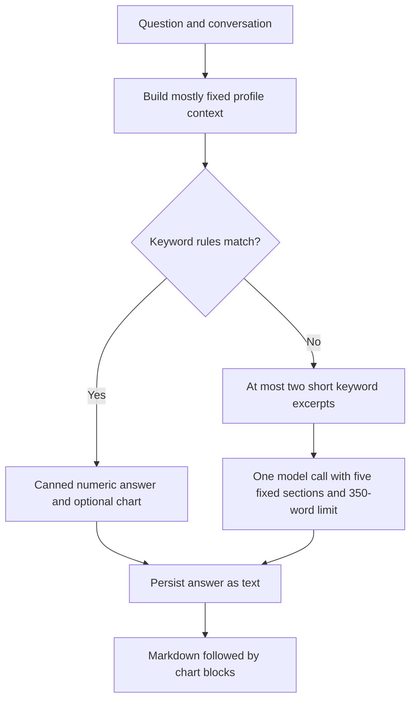
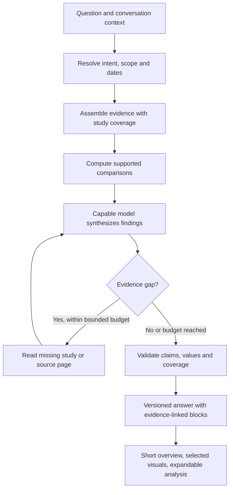

# Hearth chat quality assessment

Assessment date: 9 September 2026. Priority order: analysis quality, understandable visuals, then brevity.

## Conclusion

Hearth's current chat deliberately optimizes for cheap deterministic answers. Its routing, evidence packet and presentation contract prevent it from consistently producing the cross-report interpretation in the supplied ChatGPT example. A stronger model alone cannot fix questions that never reach the model or restore evidence removed before inference.

Keep the existing database, extraction pipeline, profile isolation, normalization, audit logs and Recharts components. Change the flow to evidence assembly → capable analysis → verification → concise visual presentation. Begin with one reasoning model and deterministic tools; introduce a separate verification call for comprehensive reviews if evaluations show a benefit. A specialist-agent swarm is unnecessary for the first implementation.

This is a source-code assessment with local synthetic replays, not a review of production conversations or a re-reading of the original medical scans. The supplied report establishes desired analytical behaviors, not verified clinical ground truth. No application behavior was changed.

## What happens today

The model branch uses the Responses API, includes up to 12 prior turns, and sends a JSON context packet. There are no retrieval tools, source-page reads, explicit reasoning-effort settings, response verification, or structured answer schema in this call. Selection is `REASONING_MODEL` → `OPENAI_MODEL` → `gpt-4o`; the deployed override has not been verified. [Answer implementation](../src/lib/ai/answer.ts), [model selection](../src/lib/ai/models.ts), [request route](../src/app/api/ai/ask/route.ts).

## Findings, ranked by effect on quality

### 1. Broad clinical questions bypass reasoning

`tryRuleAnswer` matches words such as improved, worse, changes and concerning. Whole-record questions can return immediately from functions that inspect only numeric observations. Report findings, diagnoses, symptoms and conversation history do not participate in these answers. Adding “why” does not reliably force model analysis.

Consequently, a question about overall improvement can get a list of reference-range movements with no synthesis across weight, imaging, laboratories and newly documented conditions. This behavior is intentional in existing tests. [Routing](../src/lib/ai/rules.ts:84), [tests](../src/lib/ai/rules.test.ts).

Recommendation: retain a narrowly defined direct-lookup path for requests such as “show my latest ALT value.” Any interpretation, prioritization, causal question, broad review or mixed request goes through reasoning. When intent is ambiguous, prefer reasoning. Turn the rules engine into calculation tools rather than the final author of clinical interpretations.

### 2. Chat drops evidence that extraction and storage already preserve

The database stores document IDs, diagnostic measurement page metadata, extraction confidence, report study names, modality, facility, full findings and page ranges. The chat packet keeps substantially less: observations become test/date/value/range/flag, and reports become date/type/specialty/summary/impression. Medication tables are not loaded into the packet.

This makes specific source citations, cross-machine comparability and review of complete findings unnecessarily difficult. Machine metadata is not a dedicated extraction field today; preserve printed method/device information explicitly and re-read source pages when absent. Do not assume the device is known just because a generic database device field exists. [Context mapping](../src/lib/ai/context.ts:269), [report storage](../src/db/schema.ts:601), [acceptance metadata](../src/app/api/extractions/[id]/accept/route.ts:473).

The report query also takes the first 50 records by ascending creation time. Once that cap is exceeded, later uploads can be omitted. Observations and rollups have independent recency caps of 2,000 and 300. These caps are not a relevance or coverage strategy.

Recommendation: assemble a question-specific packet with an explicit coverage manifest. A “2026 review” should enumerate the year's documents and study types, include relevant baseline and latest studies, and disclose unavailable or unconfirmed evidence. Use a compact report index plus full relevant study findings and selected source pages. Keep wearable summaries subordinate to the clinical question.

### 3. The fallback retrieval cannot discover the whole story

Retrieval uses literal words from the current question, searches the first occurrence of each keyword in extracted text, and returns at most two windows of about 500 characters. A broad question need not contain “gallstones,” “bronchodilator” or a scanner model; therefore the important details may never be retrieved. It also does not use conversation history to resolve references such as “what about that scan?” [Snippet retrieval](../src/lib/ai/snippets.ts:19).

Recommendation: resolve the question using conversation context, then combine structured SQL retrieval, a date/study inventory, and section-level text retrieval. For broad reviews, deliberately cover the relevant reports rather than relying only on keyword ranking. Add semantic retrieval when evaluation demonstrates missed relevant sections; a new vector database is not a prerequisite. Permit bounded follow-up reads of full studies or authenticated original pages when evidence is ambiguous.

### 4. Arithmetic and clinical interpretation are conflated

The changes table uses a universal 5% threshold and distance from a reference interval as “improved/worsened.” The prompt makes those verdicts authoritative. Yet a lab reference interval, a patient-specific target, a meaningful trend and measurement comparability are different concepts.

Grouping is by test name; method, protocol and residual unit incompatibility are not independently checked here. Same-day measurements are excluded from longitudinal comparisons, but paired study comparisons such as pre/post measurements require their own representation. Date parsing handles relative periods, not explicit requests such as March–September 2026.

There is also a concrete single-test bug: `lastAbnormal && Math.abs(pct) >= 5` generates “moving the wrong way” even when a high result falls toward the range. [Trend verdict](../src/lib/ai/rules.ts:146), [change classification](../src/lib/ai/changes.ts:81).

Recommendation: calculations should return values, dates, absolute/percentage changes, range crossings, source references and comparability flags. Keep “increased/decreased,” “outside the printed range,” and “clinically improved/worsened” separate. Block unsupported comparisons; let the analysis explain uncertain direction. Replace universal significance claims with metric-appropriate logic where justified, and uncertainty elsewhere. Use explicit baseline/end dates with an as-of date, rather than silently substituting a six-month window.

### 5. The prompt spends too much space on format and persona

Every response must include Answer, Data used, Confidence, Possible confounders and Discuss with your doctor, all under 350 words. The persona demands encouragement or sternness. Deterministic responses also declare high confidence merely because they are computed.

These instructions favor repetitive packaging over prioritization, and can give overly confident interpretations of incomplete evidence. The “use ONLY context” instruction also fails to distinguish patient facts from general medical knowledge. [Prompt](../src/lib/ai/answer.ts:5).

Recommendation: establish an evidence-based health analyst voice. Require supported patient-specific claims, calibrated uncertainty, separation of observation from inference, attention to contradictions and proportionate next steps. Use general medical knowledge for explanation, and source current clinical recommendations through vetted references when needed. Keep patient-record citations and external medical references distinct. Treat retrieved documents as evidence, never instructions.

Remove the global word limit from the analysis stage. Apply a soft length target to the visible overview only, preserving necessary caveats and actions. The internal artifact should contain findings and evidence references, not a request to reveal private chain-of-thought.

### 6. Charts exist, but the model does not have a chart contract

Hearth already has change tables, reference-band comparisons and single-series charts. Rules emit them as JSON hidden in a markdown fence. The model prompt asks for markdown tables and does not describe the chart schema. Parsing casts arbitrary arrays without runtime validation, and charts render after all prose. [Block types](../src/lib/ai/blocks.ts), [rendering](../src/components/ai/answer-blocks.tsx).

Recommendation: return a versioned, validated answer object with ordered blocks and evidence references. The model selects a chart purpose and observation IDs; server code supplies chart values and computed deltas. Validate IDs, units, dates, finite values and cross-source comparability before rendering. Retain a reader for historic fenced answers while storing new answers structurally.

The current time-series chart uses categorical date spacing and a smoothed curve. Use a real time axis and visible points, usually connected by straight segments. Do not imply continuous measurements between sparse tests, or join incompatible scanner measurements as one precise series.

## Proposed architecture

An evidence item should carry `id`, `documentId`, `reportId` where applicable, page, observed date, study/metric identity, value, original and normalized units, printed reference range, source text, confirmation state, extraction confidence, and method/device/protocol when known. Distinguish printed negatives, absent mentions and missing documents. Distinguish confirmed clinical records from extracted unconfirmed material and patient-reported history.

An analysis finding should carry a concise claim, evidence IDs, priority, observed-versus-inferred status, supporting and conflicting evidence, uncertainty, and relevant follow-up. This is a compact auditable conclusion, not an unrestricted narrative scratchpad.

An answer can contain ordered `summary`, `comparison`, `trend`, `finding`, `next-steps`, and `details` blocks. Every visual point should resolve to an evidence item. “Data used” becomes a source drawer and coverage note, not a mandatory paragraph on every turn. Persist selected evidence and scope for follow-ups: currently chart blocks are stripped from history, so the model cannot see the exact earlier chart selection.

Configure the reasoning model explicitly and evaluate supported reasoning settings. Compare models using identical evidence and prompts; do not attribute a retrieval improvement to model capability. Prefer one capable synthesis pass over unnecessary orchestration. For comprehensive reviews, test a second focused reviewer for missing major findings, unsupported claims and contradictions. Deterministic validators can check arithmetic and source IDs but cannot establish that a medical interpretation is correct. A reviewer model also does not guarantee correctness.

The request route currently has a 60-second duration setting and waits for patient-datapoint extraction after saving the answer. Longer reviews need measured latency budgets, progress events and possibly a durable job with reconnect support, depending on hosting limits. Capture patient-reported facts durably outside the critical response path; do not use unreliable fire-and-forget server work. Stream progress during verification and then validated answer sections, avoiding premature publication of unchecked claims.

## Visual response for the supplied example

Treat the supplied numbers as illustrative until checked against the scans. The overview should explain the overall trajectory, the most important unresolved concern and the main comparison limitation in two or three sentences.

Then show:

1. **Selected change comparisons:** weight and relevant adiposity measurements, with dates and sources. Separate cross-machine body-composition estimates and display the comparability caveat beside them. Do not present an exact muscle-loss verdict.
2. **Study timeline:** June and September liver/gallbladder findings, showing exactly what each report documented. Categorical findings belong in a timeline or comparison table.
3. **Current results:** a compact table for important liver markers and relevant metabolic measures, with printed ranges and source links. A single September result is a current value, not a trend line. Keep different units in separate rows or small charts.

Follow with the top few next steps and expandable sections for the fuller interpretation, reassuring findings, limitations and source pages. Keep essential uncertainty visible. Do not hide a potentially important finding in a collapsed section just to meet a word target.

Aim initially for roughly 150–250 words of visible interpretation plus selected visuals for a broad review, but treat that as a usability hypothesis. More detail is appropriate when needed. Questions asking only for one value should be much shorter. Avoid repeated tables, excessive charts and lists of every normal result.

## Evaluation and implementation order

### Phase 1: establish the quality floor

Build a small fixed review set using source-verified records: the 2026 longitudinal review, a single-test lookup, a “why?” follow-up, a broad concerns question, different-machine measurements, missing baseline, conflicting dates/units, same-day protocol measurements, and a record with no abnormal numeric flags but a documented imaging finding.

Fix broad-question routing and the trend-direction bug. Replace authoritative clinical verdicts with supported calculations. Include complete relevant findings and available provenance, remove the global 350-word constraint, and configure the reasoning model explicitly. Keep changes behind a reversible configuration switch for comparison.

### Phase 2: make evidence and answers structured

Introduce explicit date scope, evidence IDs, coverage checks and bounded source retrieval. Add the answer schema, source drawer, ordered blocks and safe chart-value resolution. Preserve compatibility with stored text conversations. Extend method/protocol metadata and selectively re-read existing source documents when needed.

### Phase 3: tune analysis and delivery

Run blind pairwise model/prompt comparisons, add targeted review where it improves results, measure runtime, and implement progress/reconnect if required. Cache report evidence by document version and invalidate it on corrections; cached conclusions must not become unexamined truth.

Evaluate quality before verbosity: coverage of major supported findings; correct cross-report synthesis; correct arithmetic and chronology; treatment of contradictory evidence; comparability caveats; citation support; distinction between documented negatives and missing evidence; appropriately bounded actions. Use human review for clinical judgment. Track invented values and unsupported high-impact claims as release blockers rather than averaging them into a good score.

Only after an answer clears that floor evaluate chart usefulness, reading comprehension, unnecessary repetition, length, latency and cost. Log prompt/schema version, model/configuration, evidence IDs and versions, resolved scope, retrieval activity, coverage gaps, validation results, token usage and timing. Existing context logs are useful, but omit prompt version/settings and the exact replayed history.

## Verification performed

Five existing AI test files passed: 19 tests covering rules, changes, blocks, conversations and model selection. The pnpm wrapper attempted dependency reconciliation and aborted; the same installed Vitest runner was invoked directly, without changing dependencies.

A local synthetic replay, with ALT 100 → 60 and a gallstone finding in report/diagnosis context, reproduced:

| Request or input | Observed behavior |
| --- | --- |
| “How has my overall health improved in 2026?” | Rules-engine answer; gallstone finding omitted; scope described as last six months. |
| “How has my ALT trended and why?” | Rules-engine answer; correctly computes a 40% fall, then says it is moving the wrong way. |
| “What is concerning in my records?” | Lists numeric ALT flag and ignores the supplied gallstone finding. |
| 49 → 51 with upper reference bound 50 | Classified stable because the relative move is below 5%, without a separate threshold-crossing signal. |
| “Compare March and September 2026” | Relative-window parser returns null. |

The ALT baseline in this replay is invented test data, not a statement about the user's actual March result. Production model configuration, production logs, full source scans and model answer quality were not exercised in this assessment. Application code and dependencies were left unchanged; only this assessment was added.
